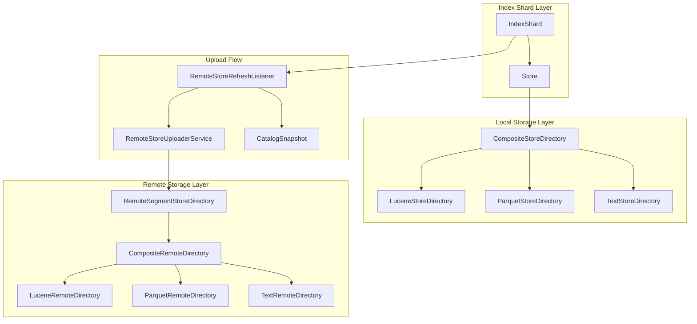
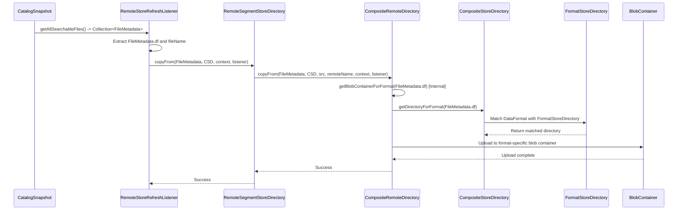

# Design Document

## Overview

This design document outlines the architecture for enhancing OpenSearch's storage system to support multiple data formats (Lucene, Parquet, and future formats) through composite directories. The design focuses on migrating from file name-based format detection to FileMetadata-based format routing, ensuring all formats are treated equally through a generic composite flow.

## Architecture

### High-Level Architecture



### Format Routing Flow



## Components and Interfaces

### 1. Enhanced FileMetadata Usage

The existing `FileMetadata(DataFormat df, String fileName)` record will be the primary mechanism for format determination.

**Key Changes:**
- Upload flow will use `Collection<FileMetadata>` from catalog snapshots
- Format routing based on `FileMetadata.df` field
- Elimination of file extension-based detection in favor of metadata

### 2. FormatStoreDirectory Interface Enhancement

```java
public interface FormatStoreDirectory<T extends DataFormat> extends Directory {
    /**
     * Returns the DataFormat this directory handles
     */
    T getDataFormat();
    
    /**
     * Checks if this directory can handle the given DataFormat
     */
    default boolean supportsFormat(DataFormat format) {
        return getDataFormat().equals(format);
    }
    
    /**
     * Legacy method for backward compatibility - will be deprecated
     */
    @Deprecated
    boolean acceptsFile(String fileName);
}
```

### 3. CompositeStoreDirectory Enhancement

**Current State:** Uses file extension-based routing via `getDirectoryForFile(String fileName)`

**Enhanced Design:**
```java
public class CompositeStoreDirectory extends Directory {
    private final Map<DataFormat, FormatStoreDirectory> formatDirectories;
    
    /**
     * New primary routing method based on FileMetadata
     */
    public FormatStoreDirectory getDirectoryForFormat(DataFormat format) {
        FormatStoreDirectory directory = formatDirectories.get(format);
        if (directory == null) {
            throw new IllegalArgumentException("No directory found for format: " + format);
        }
        return directory;
    }
    
    /**
     * Legacy method for backward compatibility
     */
    @Deprecated
    public FormatStoreDirectory getDirectoryForFile(String fileName) {
        // Fallback to extension-based detection for backward compatibility
    }
    
    /**
     * All Directory API methods enhanced to use FileMetadata for format routing
     */
    public long fileLength(FileMetadata fileMetadata) throws IOException {
        FormatStoreDirectory formatDirectory = getDirectoryForFormat(fileMetadata.df());
        return formatDirectory.fileLength(fileMetadata.fileName());
    }
    
    public void deleteFile(FileMetadata fileMetadata) throws IOException {
        FormatStoreDirectory formatDirectory = getDirectoryForFormat(fileMetadata.df());
        formatDirectory.deleteFile(fileMetadata.fileName());
    }
    
    public IndexInput openInput(FileMetadata fileMetadata, IOContext context) throws IOException {
        FormatStoreDirectory formatDirectory = getDirectoryForFormat(fileMetadata.df());
        return formatDirectory.openInput(fileMetadata.fileName(), context);
    }
    
    public IndexOutput createOutput(FileMetadata fileMetadata, IOContext context) throws IOException {
        FormatStoreDirectory formatDirectory = getDirectoryForFormat(fileMetadata.df());
        return formatDirectory.createOutput(fileMetadata.fileName(), context);
    }
    
    public void copyFrom(FileMetadata fileMetadata, Directory source, IOContext context) throws IOException {
        FormatStoreDirectory targetDirectory = getDirectoryForFormat(fileMetadata.df());
        targetDirectory.copyFrom(source, fileMetadata.fileName(), context);
    }
    
    /**
     * Legacy methods for backward compatibility - delegate to extension-based detection
     */
    @Override
    @Deprecated
    public long fileLength(String name) throws IOException {
        FormatStoreDirectory formatDirectory = getDirectoryForFile(name);
        return formatDirectory.fileLength(name);
    }
    
    @Override
    @Deprecated
    public void deleteFile(String name) throws IOException {
        FormatStoreDirectory formatDirectory = getDirectoryForFile(name);
        formatDirectory.deleteFile(name);
    }
}
```

### 4. RemoteSegmentStoreDirectory Enhancement

**Current State:** Uses `remoteDataDirectory` for uploads

**Enhanced Design:**
```java
public final class RemoteSegmentStoreDirectory extends FilterDirectory {
    private final CompositeRemoteDirectory compositeRemoteDirectory; // Replace remoteDataDirectory
    
    /**
     * Enhanced copyFrom method accepting FileMetadata
     * RemoteSegmentStoreDirectory should not know about blob containers - 
     * that's handled internally by CompositeRemoteDirectory
     */
    public void copyFrom(FileMetadata fileMetadata, CompositeStoreDirectory from, 
                        IOContext context, ActionListener<Void> listener, boolean lowPriorityUpload) {
        
        String fileName = fileMetadata.fileName();
        String remoteFileName = getNewRemoteSegmentFilename(fileName);
        
        // Delegate to CompositeRemoteDirectory which handles format routing internally
        compositeRemoteDirectory.copyFrom(fileMetadata, from, fileName, remoteFileName, 
                                        context, listener, lowPriorityUpload);
    }
    
    /**
     * Legacy method for backward compatibility
     */
    @Deprecated
    public void copyFrom(CompositeStoreDirectory from, String src, IOContext context,
                        ActionListener<Void> listener, boolean lowPriorityUpload) {
        // Fallback implementation using file extension detection
    }
}
```

### 5. CompositeRemoteDirectory Enhancement

**Current Implementation:** Already supports format-specific blob containers

**Enhanced Design:**
```java
public class CompositeRemoteDirectory {
    private final Map<String, BlobContainer> formatBlobContainers;
    
    /**
     * Enhanced copyFrom method that handles format routing internally
     * RemoteSegmentStoreDirectory should not know about blob containers
     */
    public void copyFrom(FileMetadata fileMetadata, CompositeStoreDirectory from, 
                        String src, String remoteFileName, IOContext context, 
                        ActionListener<Void> listener, boolean lowPriorityUpload) {
        
        DataFormat format = fileMetadata.df();
        
        // Get format-specific blob container internally
        BlobContainer formatContainer = getBlobContainerForFormat(format);
        
        // Get format-specific source directory
        FormatStoreDirectory formatDirectory = from.getDirectoryForFormat(format);
        
        // Handle the upload to the correct format container
        uploadToFormatContainer(formatContainer, formatDirectory, src, remoteFileName, 
                              context, listener, lowPriorityUpload);
    }
    
    /**
     * Internal method for getting format-specific blob containers
     */
    private BlobContainer getBlobContainerForFormat(DataFormat format) {
        return getBlobContainerForFormat(format.name().toLowerCase());
    }
    
    private BlobContainer getBlobContainerForFormat(String format) {
        return formatBlobContainers.computeIfAbsent(format, f -> {
            BlobPath formatPath = baseBlobPath.add(f.toLowerCase());
            return blobStore.blobContainer(formatPath);
        });
    }
}
```

### 6. Upload Flow Enhancement

**Current Flow:**
1. `RemoteStoreRefreshListener.syncSegments()`
2. `extractSegments(SegmentInfos)` → `Collection<String>`
3. `uploadNewSegments(Collection<String>)`
4. `copyFrom(CompositeStoreDirectory, String, IOContext)`

**Enhanced Flow:**
1. `RemoteStoreRefreshListener.syncSegments()`
2. `indexShard.getCatalogSnapshotFromEngine().getAllSearchableFiles()` → `Collection<FileMetadata>`
3. `uploadNewSegments(Collection<FileMetadata>)`
4. `copyFrom(FileMetadata, CompositeStoreDirectory, IOContext)`

### 7. RemoteStoreUploaderService Enhancement

```java
public class RemoteStoreUploaderService {
    /**
     * Enhanced upload method using FileMetadata
     */
    public void uploadSegments(
        Collection<FileMetadata> fileMetadataCollection,
        Map<String, Long> fileSizeMap,
        ActionListener<Void> listener,
        Function<Map<String, Long>, UploadListener> uploadListenerFunction,
        boolean lowPriorityUpload
    ) {
        for (FileMetadata fileMetadata : fileMetadataCollection) {
            if (!skipUpload(fileMetadata.fileName())) {
                remoteDirectory.copyFrom(fileMetadata, compositeStoreDirectory, 
                                       IOContext.DEFAULT, listener, lowPriorityUpload);
            }
        }
    }
}
```

## Data Models

### FileMetadata Record
```java
public record FileMetadata(DataFormat df, String fileName) {
    // Existing implementation - no changes needed
}
```

### DataFormat Enum
```java
public enum DataFormat {
    LUCENE,
    PARQUET,
    TEXT
    // Future formats can be added here
}
```

### Format Directory Mapping
```java
// In CompositeStoreDirectory
private final Map<DataFormat, FormatStoreDirectory> formatDirectories = Map.of(
    DataFormat.LUCENE, luceneStoreDirectory,
    DataFormat.PARQUET, parquetStoreDirectory,
    DataFormat.TEXT, textStoreDirectory
);
```

### Blob Container Mapping
```java
// In CompositeRemoteDirectory
private final Map<String, BlobContainer> formatBlobContainers = Map.of(
    "lucene", luceneBlobContainer,      // basePath/lucene/
    "parquet", parquetBlobContainer,    // basePath/parquet/
    "text", textBlobContainer           // basePath/text/
);
```

## Error Handling

### Format Not Found
```java
public FormatStoreDirectory getDirectoryForFormat(DataFormat format) {
    FormatStoreDirectory directory = formatDirectories.get(format);
    if (directory == null) {
        throw new IllegalArgumentException(
            String.format("No directory registered for format: %s. Available formats: %s", 
                         format, formatDirectories.keySet())
        );
    }
    return directory;
}
```

### Fallback Mechanism
```java
public void copyFrom(FileMetadata fileMetadata, CompositeStoreDirectory from, 
                    IOContext context, ActionListener<Void> listener) {
    try {
        // Primary path: Use FileMetadata
        copyFromWithMetadata(fileMetadata, from, context, listener);
    } catch (Exception e) {
        logger.warn("FileMetadata-based upload failed for {}, falling back to extension detection", 
                   fileMetadata.fileName(), e);
        // Fallback: Use file extension detection
        copyFromLegacy(from, fileMetadata.fileName(), context, listener);
    }
}
```

### Upload Failure Recovery
```java
private void handleUploadFailure(FileMetadata fileMetadata, Exception error, 
                               ActionListener<Void> listener) {
    logger.error("Upload failed for file {} with format {}: {}", 
                fileMetadata.fileName(), fileMetadata.df(), error.getMessage(), error);
    
    // Update segment tracker with failure
    segmentTracker.incrementFormatUploadFailure(fileMetadata.df().name());
    
    // Notify listener of failure
    listener.onFailure(new SegmentUploadFailedException(
        String.format("Failed to upload %s (%s format)", 
                     fileMetadata.fileName(), fileMetadata.df()), error));
}
```

## Testing Strategy

### Unit Tests

1. **FormatStoreDirectory Tests**
   - Verify each directory declares correct DataFormat
   - Test format-specific operations
   - Validate directory creation and initialization

2. **CompositeStoreDirectory Tests**
   - Test format routing based on FileMetadata.df
   - Verify fallback to extension-based detection
   - Test error handling for unknown formats

3. **RemoteSegmentStoreDirectory Tests**
   - Test FileMetadata-based copyFrom method
   - Verify format-specific blob container routing
   - Test backward compatibility with string-based methods

### Integration Tests

1. **End-to-End Upload Flow**
   - Test complete flow from catalog snapshot to remote storage
   - Verify files are uploaded to correct format containers
   - Test mixed format uploads (Lucene + Parquet)

2. **Format Plugin Discovery**
   - Test automatic discovery of format directories
   - Verify plugin-based format registration
   - Test graceful handling of missing plugins

3. **Backward Compatibility**
   - Test Lucene-only deployments continue working
   - Verify legacy API methods still function
   - Test migration scenarios

### Performance Tests

1. **Format Routing Performance**
   - Benchmark FileMetadata-based vs extension-based routing
   - Test performance with large numbers of files
   - Measure memory usage of format directory mappings

2. **Upload Performance**
   - Compare upload speeds across different formats
   - Test concurrent uploads to different format containers
   - Measure impact of format-aware routing on throughput

## Migration Strategy

### Phase 1: Infrastructure Setup
- Enhance FormatStoreDirectory interface with DataFormat declaration
- Update CompositeStoreDirectory with format-based routing
- Modify RemoteSegmentStoreDirectory to use CompositeRemoteDirectory

### Phase 2: Upload Flow Enhancement
- Update RemoteStoreRefreshListener to use FileMetadata from catalog snapshots
- Enhance RemoteStoreUploaderService for FileMetadata-based uploads
- Implement new copyFrom methods accepting FileMetadata

### Phase 3: Format Implementation
- Ensure LuceneStoreDirectory declares DataFormat.LUCENE
- Implement ParquetStoreDirectory with DataFormat.PARQUET
- Add any additional format directories as needed

### Phase 4: Testing and Validation
- Comprehensive testing of all format combinations
- Performance validation and optimization
- Backward compatibility verification

### Phase 5: Deprecation and Cleanup
- Mark legacy file extension-based methods as deprecated
- Provide migration guides for custom implementations
- Plan eventual removal of deprecated methods in future versions